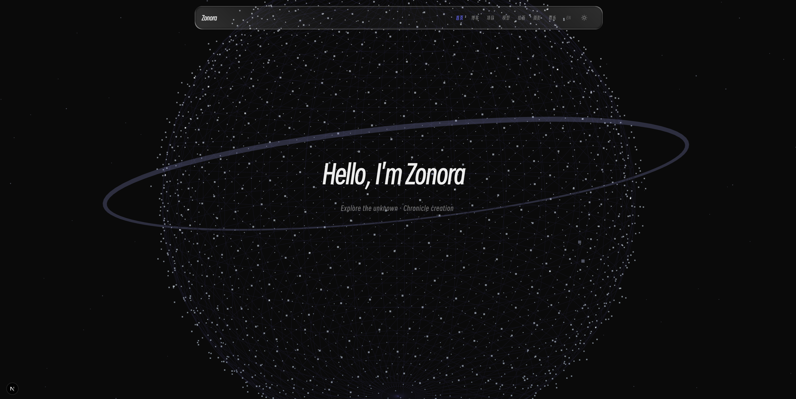
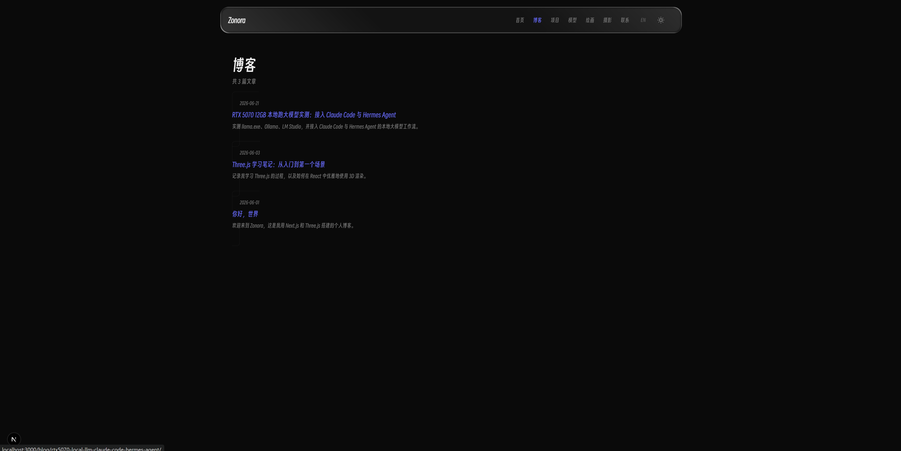
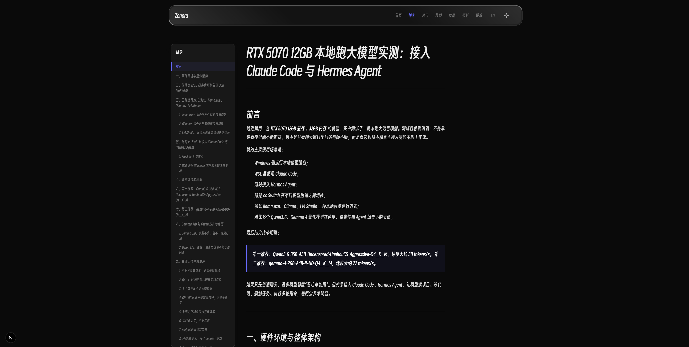
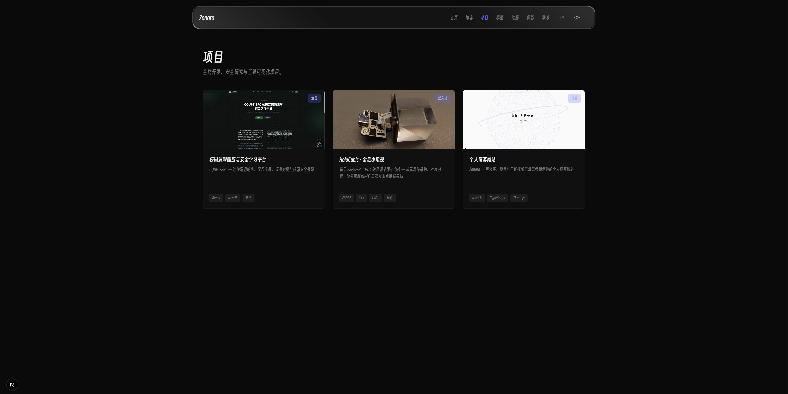
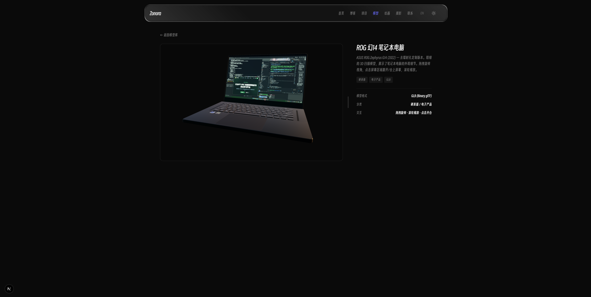
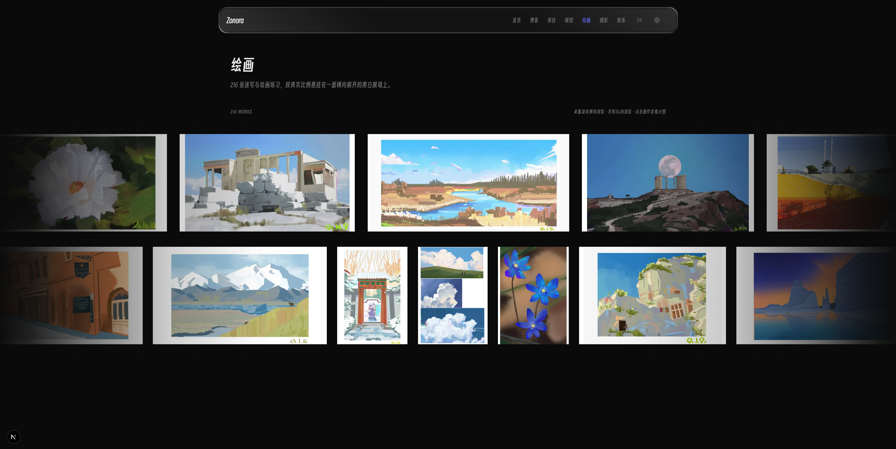
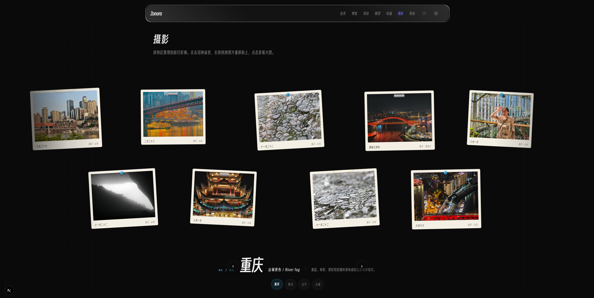

# Zonora — 个人博客

<div align="center">

[](https://nextjs.org/)
[](https://www.typescriptlang.org/)
[](https://tailwindcss.com/)
[](https://threejs.org/)

**用文字与三维世界记录思考与创造。**

</div>

---

## 概览

Zonora 是一个面向创作者的个人博客站点，融合了文章阅读、项目展示、3D 模型交互、绘画画廊和摄影作品等模块。首页以全屏粒子地球为背景，支持鼠标跟随旋转；各页面通过平滑过渡动画衔接，整体在暗/亮两种主题之间自由切换。


*首页全屏粒子地球效果：2800 个按 Fibonacci 球面均匀分布的粒子点阵，鼠标悬停时沿光标方向旋转，离开后自动回到默认姿态。*

---

## 技术栈

| 类别 | 技术选型 |
|------|----------|
| **框架** | Next.js 14+ (App Router, Server Components) |
| **语言** | TypeScript 5.0+ |
| **样式** | Tailwind CSS v4 + 自定义 CSS 变量 (`data-theme`) |
| **3D / WebGL** | @react-three/fiber + @react-three/drei + Three.js |
| **内容** | MDX（博客文章支持代码块、组件嵌入） |
| **国际化** | i18n（中文/英文双语，`LangProvider` 全局切换） |
| **部署** | Vercel / Docker / 任意 Node.js 静态站点托管 |

---

## 快速开始

```bash
# 1. 克隆仓库
git clone https://github.com/Zonora-Wu/zonora.git
cd zonora

# 2. 安装依赖
npm install

# 3. 启动开发服务器
npm run dev
```

站点默认运行在 `http://localhost:3000`。

> **环境变量**：当前无需额外 `.env` 文件，所有配置内聚于项目源码中。如需自定义（如 API Key、域名等），可在 `.env.local` 中添加对应变量。

---

## 页面导航与功能说明

### 首页 (Home)

首页是访客的第一触点。核心体验包括：

- **粒子地球**：基于 `GlobeScene.tsx`，使用 Three.js BufferGeometry 创建 2800 个 Fibonacci 球面分布粒子点，颜色随纬度渐变（从深蓝到亮蓝）。鼠标移动时 Globe 沿光标方向平滑旋转；超过 2.4 秒无操作则自动回归默认缓慢自转。
- **打字标题动画**：`TypewriterTitle.tsx` 实现逐字打出 / 擦除循环的标题效果，营造节奏感。
- **导航栏隐藏/揭示机制**：首页加载时导航栏默认收起（不遮挡粒子地球），点击页面任意位置或按功能键后浮现；非首页路径下导航栏始终可见。

### 博客页 (Blog)

博客模块以 MDX 驱动，支持富文本、代码块、内联组件等高级写法。


*博客列表：按时间倒序排列的文章卡片网格视图，每张卡片包含标题、摘要和发布日期。*

- **文章列表** (`/blog`)：卡片式布局，展示文章标题、摘要和发布时间；支持平滑分页与页面过渡动画。
- **文章阅读** (`/blog/[slug]`)：`BlogArticleTemplate.tsx` 渲染 MDX 内容，侧边栏提供目录导航（`ArticleToc`），代码块内置复制按钮（`CodeCopyButton`）。


*单篇文章阅读：MDX 富文本渲染、右侧目录锚点导航、代码块一键复制功能。*

### 项目页 (Projects)

展示个人开发的项目作品。


*项目展示：卡片式排列，每个项目包含缩略图、标题和技术栈标签。*

- **项目列表** (`/projects`)：网格布局的项目卡片，每张卡片展示项目名称、描述和技术标签。
- **项目详情** (`/projects/[slug]`)：深入介绍单个项目，包括技术选型、设计思路、截图等详细内容。

### 模型页 (Models) — 3D 交互体验

这是 Zonora 的亮点模块，将 Three.js 与 Next.js 深度融合。


*3D 模型交互：拖拽旋转、滚轮缩放、点击开合盖动画，HDR 环境光实时渲染。*

核心功能包括：

- **GLB/GLTF 模型加载**：通过 `GLTFLoader` 加载优化后的 `.glb` 文件（如 `rog14-cleaned.glb`），自动计算包围盒并将模型原点平移至几何中心，确保视图居中且比例正确。
- **HDR 环境光渲染**：使用 `EXRLoader` 加载 EXR 格式 HDR 贴图（如 `sunset_2K.exr`），经 PMREMGenerator 生成环境映射，为模型提供真实的全局光照反射效果。
- **交互控制**：基于 `OrbitControls`，支持鼠标拖拽旋转、滚轮缩放；特定模型支持点击触发展开/闭合动画（如笔记本开盖）。
- **接触阴影**：使用 `ContactShadows` 组件在模型底部生成柔和接地阴影，增强三维空间感。

### 绘画页 (Art) — 沉浸式画廊


*艺术画廊：Three.js Canvas 渲染的沉浸式场景，作品以自然排列方式融入环境。*

- **3D 艺术场景**：`ArtWallScene.tsx` + `ArtWallSceneWrapper.tsx` 使用 Three.js Canvas 构建虚拟画展空间，绘画作品以自然角度悬挂在"墙面"上。
- **Lightbox 灯箱**：点击图片触发 `ArtworkLightbox` 全屏预览，支持关闭和键盘导航（ESC）。

### 摄影页 (Photo) — 磁贴式自由布局


*摄影作品：磁贴风格的照片排列，支持长按拖拽调整位置、点击查看详情。*

- **磁贴式布局** (`PhotoMagnet`)：每张照片以磁贴样式呈现，带有轻微随机旋转和偏移；用户可**长按（220ms 阈值）**拖拽自由调整照片位置，松手后自动吸附到最近网格并持久化。
- **Region Wall** (`PhotoRegionWall`)：按区域分类展示摄影作品，支持分组浏览。
- **双排横向排列**：进入时照片分为上下两排横排（非竖排），类似 `balancedRows` 布局；每排内照片均匀分布、居中对齐。

### 联系页 (Contact)

提供联系方式与社交链接入口，方便访客与作者建立联系。

---

## 架构设计

```
zonora/
├── app/                          # Next.js App Router 路由
│   ├── page.tsx                  # 首页入口
│   ├── layout.tsx                # 根布局（ThemeProvider + LangProvider + NavHeader）
│   ├── blog/[slug]/page.tsx      # MDX 文章页
│   ├── models/[slug]/page.tsx    # 3D 模型详情页
│   ├── projects/[slug]/page.tsx  # 项目详情页
│   └── ...                       # 其他页面路由
├── components/                   # React 组件
│   ├── GlobeScene.tsx            # 首页粒子地球（Three.js）
│   ├── ModelViewer.tsx           # 3D 模型查看器（GLTFLoader + HDR + OrbitControls）
│   ├── ArtWallScene.tsx          # 绘画场景（Three.js Canvas）
│   ├── PhotoMagnet.tsx           # 摄影磁贴组件（长按拖拽布局）
│   ├── NavHeader.tsx             # 全局导航栏（玻璃拟态 + 首页隐藏/揭示）
│   └── ...                       # ThemeProvider, LangProvider, PageTransition 等
├── data/                         # 静态数据（文章元信息、项目列表等）
├── public/                       # 静态资源（图片、3D模型 .glb、HDR .exr、字体）
│   ├── sketches/                 # 速写作品集 (YYYY-MM-DD.jpeg)
│   └── hdr/                    # HDR 环境贴图
└── styles/                       # Tailwind CSS + 全局样式
```

### 关键设计决策

| 决策点 | 选型 | 原因 |
|--------|------|------|
| **路由** | Next.js App Router (trailingSlash) | SEO 友好，天然支持 MDX，`redirects()` 与 trailingSlash 兼容 |
| **3D** | react-three-fiber + drei | React 声明式 WebGL，社区生态成熟，性能优于原生 Three.js |
| **主题** | CSS `data-theme` 属性选择器 | 零运行时开销，配合 `matchMedia('prefers-color-scheme')` 自动同步系统偏好 |
| **导航** | 首页点击揭示 + 非首页常驻 | 最大化首页沉浸感，同时保证导航可用性 |
| **预取** | `requestIdleCallback` + `router.prefetch()` | 空闲时预加载所有导航目标页面，切换几乎零延迟 |

---

## 主题与国际化

### 暗/亮主题切换

站点支持完整的暗色/亮色主题，通过 `<html data-theme="dark">` / `data-theme="light"` 属性驱动全局 CSS 变量。主题偏好持久化到 `localStorage`，首次加载时自动检测系统 `prefers-color-scheme` 并同步。

### 中英双语切换

内置国际化支持（中文/英文），通过 `LangProvider` + `useLang()` hook 实现全局语言切换。导航栏中的多语言标签（如"博客"/"Blog"）由 i18n 字典管理，无需额外配置即可扩展更多语言。

---

## 性能优化

- **代码分割**：3D 组件（GlobeScene, ModelViewer, ArtWallScene）通过 `next/dynamic` + SSR: false 延迟加载，首屏无需渲染 WebGL Canvas。
- **图片预加载**：导航链接使用 `requestIdleCallback` 在浏览器空闲时预取目标页面资源。
- **字体子集化**：自定义中文字体 `SmileySans-Subset.woff2` 仅包含实际使用的字符，大幅缩减体积。
- **3D 粒子优化**：首页地球使用单个 BufferGeometry（2800 点）而非独立 Mesh，单次 draw call 完成渲染。

---

## 开发约定

| 规则 | 说明 |
|------|------|
| **速写归档** | `/public/sketches/` 下按 `YYYY-MM-DD.jpeg` 命名存放速写作品 |
| **模型格式** | GLB（glTF Binary），确保 gltf-transform / DRACO 压缩优化 |
| **构建验证** | 修改后直接视为完成，不强制执行 `npm run build` |
| **前端恢复** | 禁止逐文件 cherry-pick，整目录 `git checkout <branch>` 统一分支 |

---

## 许可证

[MIT License](./LICENSE) — 自由使用、修改和分发。

---

## 相关链接

- **GitHub**: [Zonora-Wu/zonora](https://github.com/Zonora-Wu/zonora)
- **邮箱**: zonora001@gmail.com

---

> "用文字与三维世界记录思考与创造。" — Zonora
